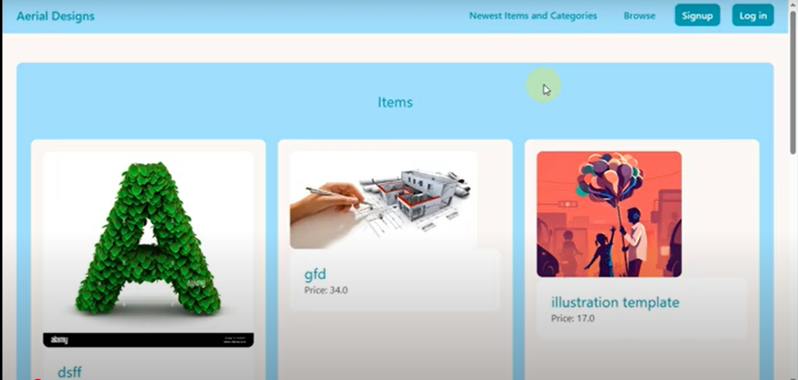

## Portfolio & E-commerce Platform (Django CMS)
Developed a web application inspired by Dribbble where multiple designers can create profiles, showcase their portfolios, and sell their designs. Integrated user authentication, item listings, order management, and portfolio views. Built using Django (backend) and Tailwind CSS (frontend) with responsive design for seamless user experience.

